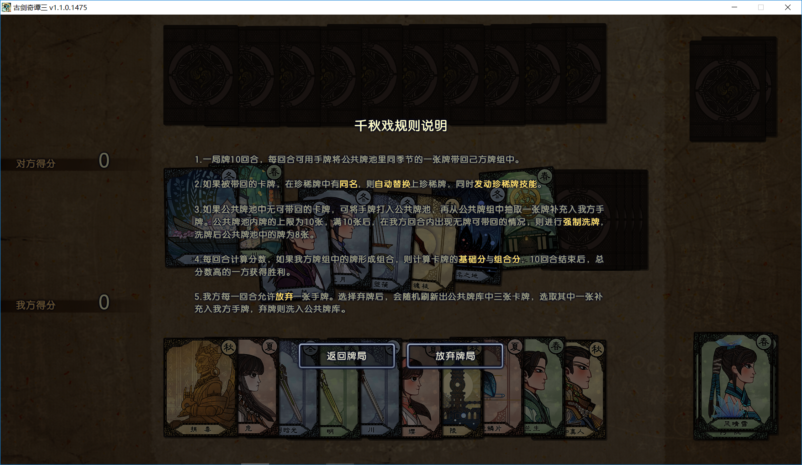
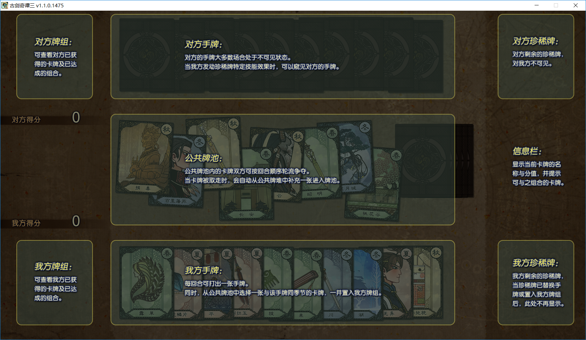
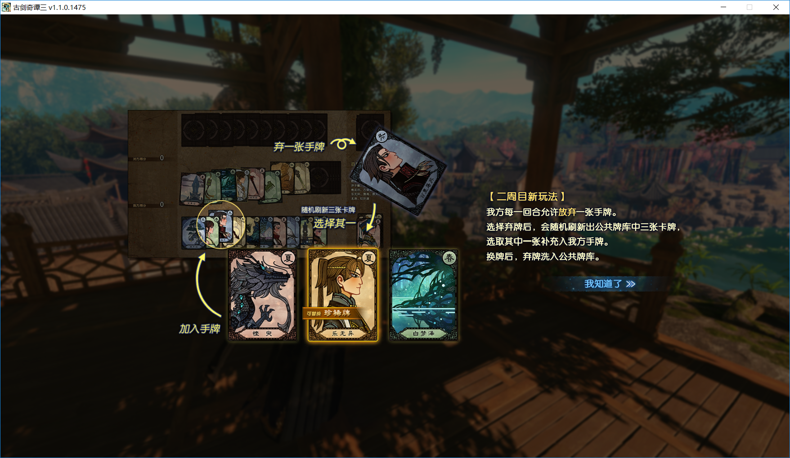

# 千秋戏

## 游戏简介

- 《古剑奇谭三》v1.0版本中，千秋戏共有82张卡牌，其中包括52张一代和二代人物普通牌、30张一代和二代人物珍稀牌。

- 《古剑奇谭三》v1.1版本中，新增了46张卡牌，其中包括28张三代人物普通牌、14张三代人物珍稀牌，以及2张一代人物普通牌和2张二代人物普通牌。至此，千秋戏总卡牌数量扩增至128张。此外，二周目中还增加了每局可丢弃手牌换取新牌的新玩法。

### 游戏规则

### 游戏布局

### 二周目新玩法

## 相关概念

### 普通牌

普通牌的牌面分值均为2分，无技能效果。

### 珍稀牌

珍稀牌的牌面分值为4分或6分，此外还附加了1~2个技能效果。

- [风晴雪·凤羲] [4分]
 技能效果一：**百里屠苏**的分数增加15分

- [方兰生·浮灯] [4分]
 技能效果一：禁用对方任意一张珍稀牌的技能

- [阿阮·神女] [4分]
 技能效果一：**露草流萤**的分数增加15分

- [沈曦·魔化] [4分]
 技能效果一：随机翻开对手手牌两张

- [巽芳·寂桐] [4分]
 技能效果一：若**欧阳少恭**在公共卡池中，则下一回合一定出现欧阳少恭

- [襄铃·泉边掬影] [4分]
 技能效果一：随机翻开对手手牌一张
 技能效果二：下一回合一定出现一个《古剑奇谭一》的主要角色

- [乐无异·捐毒] [4分]
 技能效果一：复制对方任意一张珍稀牌的技能
 技能效果二：被交换后卡牌技能无效

- [谢衣·初七] [4分]
 技能效果一：**烈山遗族**的分数增加20分
 技能效果二：随机翻开对手手牌一张

- [禺期·无名] [4分]
 技能效果一：增加**昭明**、**古剑晗光**、**无名之剑**的出现概率
 技能效果二：自身能形成的组合每个增加10分

- [悭臾·水虺] [4分]
 技能效果一：自身能形成的组合每个增加10分
 技能效果二：随机翻开对手手牌一张

- [红玉·道服] [4分]
 技能效果一：复制对方任意一张珍稀牌的技能
 技能效果二：被交换后卡牌技能无效

- [尹千觞·巫咸] [4分]
 技能效果一：若**风晴雪**在公共卡池中，则下回合一定出现**风晴雪**
 技能效果二：禁用对方任意一张《古剑奇谭一》珍稀牌的技能

- [闻人羽·闺秀] [4分]
 技能效果一：增加《古剑奇谭二》主要角色出现的概率

- [欧阳少恭·蓬莱] [4分]
 技能效果一：禁用对方任意一张珍稀牌的技能
 技能效果二：**芳华如梦**的分数增加20分

- [清和真人·温留] [4分]
 技能效果一：禁止**夏夷则**珍稀牌的技能
 技能效果二：**温茶相待**的分数增加30分

- [夏夷则·太华] [4分]
 技能效果一：**蓝衫偃师记**的分数增加20分

- [百里屠苏·天墉] [4分]
 技能效果一：**古剑焚寂**的分数增加15分
 技能效果二：下一回合一定出现一个《古剑奇谭一》的主要角色

- [沈夜·紫微] [4分]
 技能效果一：下一回合一定出现一个流月城角色
 技能效果二：随机翻开对手手牌两张

- [陵越·掌门] [4分]
 技能效果一：交换对方任意一张牌
 技能效果二：被交换后卡牌技能无效

- [华月·魔化] [4分]
 技能效果一：交换对方任意一张牌
 技能效果二：被交换后卡牌技能无效

- [风晴雪·绵羊] [6分]
 技能效果一：若**焦炭**在公共卡池中，则下回合一定出现**焦炭**
 技能效果二：**厨房功夫**的分数增加20分

- [方兰生·蓝鲲] [6分]
 技能效果一：**永相随**的分数增加20分
 技能效果二：随机翻开对手手牌一张

- [阿阮·山鬼] [6分]
 技能效果一：若**夏夷则**在公共卡池中，则下回合一定出现**夏夷则**
 技能效果二：随机翻开对手手牌一张

- [乐无异·偃师] [6分]
 技能效果一：随机翻开对手手牌三张
 技能效果二：被交换后卡牌技能无效

- [襄铃·熊猫] [6分]
 技能效果一：**黑衣少侠传**的分数增加30分
 技能效果二：下一回合一定出现一个《古剑奇谭一》的主要角色

- [红玉·兔子] [6分]
 技能效果一：**剑舞红袖**的分数增加30分
 技能效果二：禁用对方任意一张珍稀牌的技能

- [尹千觞·大狗] [6分]
 技能效果一：**醉梦江湖**的分数增加20分
 技能效果二：随机翻开对手手牌一张

- [闻人羽·天罡] [6分]
 技能效果一：**蓝衫偃师记**的分数增加30分
 技能效果二：被交换后卡牌技能无效

- [夏夷则·鲛人] [6分]
 技能效果一：禁用对方任意一张珍稀牌的技能
 技能效果二：随机翻开对手手牌两张

- [百里屠苏·黑猫] [6分]
 技能效果一：若**古剑焚寂**在公共卡池中，则下回合一定出现**古剑焚寂**
 技能效果二：**桃花幻梦**的分数增加30分

- [北洛·冕服] [4分]
 技能效果一：打出后给自身增加10分

- [云无月·华裳] [4分]
 技能效果一：随机翻开对手手牌一张

- [岑缨·劲装] [4分]
 技能效果一：**一见喜**的分数增加15分

- [姬轩辕·绣春] [4分]
 技能效果一：复制对方任意一张珍稀牌的技能

- [北洛·辟邪] [6分]
 技能效果一：**首山梦时书**的分数增加30分

- [云无月·魇魅] [6分]
 技能效果一：禁用对方任意一张珍稀牌的技能
 技能效果二：**北洛**的分数增加15分

- [岑缨·菡萏] [6分]
 技能效果一：下一回合一定出现一个《古剑奇谭三》的主要角色
 技能效果二：随机翻开对手手牌两张

- [姬轩辕·玄鹿] [6分]
 技能效果一：下一回合一定出现一个《古剑奇谭三》的主要角色
 技能效果二：**眠霜卧雪**的分数增加30分

- [缙云·卸甲] [4分]
 技能效果一：**以玉为戈**的分数增加30分
 技能效果二：随机翻开对手手牌一张

- [巫炤·吞恨] [4分]
 技能效果一：**西陵曲**的分数增加30分
 技能效果二：禁用对方任意一张珍稀牌的技能

- [司危·嫣然] [4分]
 技能效果一：下一回合一定出现一个西陵角色
 技能效果二：禁用对方任意一张《古剑奇谭三》珍稀牌的技能

- [玄戈&霓商·流光] [4分]
 技能效果一：交换对方任意一张牌
 技能效果二：被交换后卡牌技能无效

- [嫘祖·梦中人] [4分]
 技能效果一：交换对方任意一张牌
 技能效果二：被交换后卡牌技能无效

- [刘兄·比木] [4分]
 技能效果一：**玳之梦**的分数增加30分
 技能效果二：若**巫之国**在公共卡池中，则下回合一定出现**巫之国**

### 组对

下面是《古剑奇谭三》v1.1版本中千秋戏的126个**推荐组对**

- [3分] [与子成说] [风晴雪、百里屠苏]
- [3分] [乘龙归] [百里屠苏、悭臾]  
- [3分] [琴心剑魄] [百里屠苏、欧阳少恭]
- [3分] [云涌昆仑] [百里屠苏、天墉城]
- [3分] [故友赠礼] [黑龙鳞片、百里屠苏]
- [3分] [焚焰血戮] [百里屠苏、古剑焚寂]
- [4分] [陌相逢] [风晴雪、尹千觞]
- [4分] [幽都灵女] [风晴雪、幽都]
- [4分] [荒魂述] [风晴雪、天鹿城]
- [4分] [琴川友] [欧阳少恭、方兰生]
- [4分] [望乡] [琴川、方兰生]
- [4分] [永相随] [方兰生、青玉司南佩]
- [4分] [无情客] [百胜刀、方兰生]
- [4分] [芳草心] [昭明、阿阮]
- [4分] [共株生] [露草、阿阮]
- [4分] [三日遥] [沈曦、沈夜]
- [4分] [月中生] [流月城、沈曦]
- [4分] [伴长眠] [兔子抱枕、沈曦]
- [4分] [仙山眷侣] [巽芳、欧阳少恭]
- [4分] [蓬莱公主] [巽芳、蓬莱]
- [4分] [故林栖] [紫榕林、襄铃]
- [4分] [青丘有狐] [襄铃、青丘尘中记]
- [4分] [清馨戏碟] [襄铃、红叶湖]
- [4分] [春风雨] [谢衣、乐无异]
- [4分] [玉京游] [长安、乐无异]
- [4分] [沧海飞尘] [馋鸡、乐无异]
- [4分] [孤月寒灯] [谢衣、沈夜]
- [4分] [胡不归] [流月城、谢衣]
- [4分] [空留忆] [谢衣、通天之器]
- [4分] [别破军] [谢衣、忘川]
- [4分] [重山隐] [谢衣、静水湖]
- [4分] [古剑剑灵] [禺期、红玉]
- [4分] [铸剑仙师] [禺期、昭明]
- [4分] [历劫重生] [禺期、无名之剑]
- [4分] [未成之剑] [禺期、古剑晗光]
- [4分] [榣山遗韵] [悭臾、欧阳少恭]
- [4分] [水虺醉琴] [榣山、悭臾]
- [4分] [应龙信物] [黑龙鳞片、悭臾]
- [4分] [空徊] [悭臾、赤水]
- [4分] [千古剑灵] [天墉城、红玉]
- [4分] [剑舞红袖] [古剑红玉、红玉]
- [4分] [明月青霜] [安陆、红玉]
- [4分] [醉梦江湖] [尹千觞、欧阳少恭]
- [4分] [幽都巫咸] [尹千觞、幽都]
- [4分] [栖身之所] [欧阳少恭、蓬莱]
- [4分] [丹芷长老] [欧阳少恭、青玉坛]
- [4分] [故地重回] [榣山、欧阳少恭]
- [4分] [揽琴独照] [欧阳少恭、凤来]
- [4分] [烂柯] [欧阳少恭、梦魂枝]
- [4分] [太华山人] [太华山、清和真人]
- [4分] [严师胜父] [夏夷则、清和真人]
- [4分] [待佳期] [夏夷则、露草]
- [4分] [飞羽凌杀] [阿翔、百里屠苏]
- [4分] [护孤城] [华月、沈夜]
- [4分] [永夜寒沉] [流月城、沈夜]
- [4分] [天墉掌门] [天墉城、陵越]
- [4分] [月之殇] [流月城、华月]
- [4分] [廉贞曲] [华月的箜篌、华月]
- [4分] [神女静眠] [神女墓、巫山]
- [4分] [静水流深] [北洛、云无月]
- [4分] [昨日影] [缙云、北洛]
- [4分] [参商交辉] [玄戈&霓商、北洛]
- [4分] [来日可期] [天鹿城、北洛]
- [4分] [杀伐之剑] [北洛、太岁]
- [4分] [得力助手] [北洛、原天柿]
- [4分] [独歌] [云无月、白梦泽]
- [4分] [无梦之魇] [云无月、梦魂枝]
- [4分] [鸿雁于飞] [鄢陵、岑缨]
- [4分] [一见喜] [原天柿、岑缨]
- [4分] [澄心若璃] [画板、岑缨]
- [4分] [吾道不孤] [姬轩辕、岑缨]
- [4分] [昔年之乐] [姬轩辕、嫘祖]
- [4分] [轩辕氏] [姬轩辕、有熊]
- [4分] [龙去鼎湖] [姬轩辕、鼎湖]
- [4分] [云本无心] [缙云、云无月]
- [4分] [千锋辟易] [缙云、太岁]
- [4分] [邃古遗幽] [巫炤、司危]
- [4分] [恨生天地] [半魂莲、巫炤]
- [4分] [星坠] [天鹿城、玄戈&霓商]
- [4分] [镇厄] [天鹿、玄戈&霓商]
- [4分] [烽烟锁城] [西陵、嫘祖]
- [4分] [妙笔退魔] [刘兄、阳平]
- [4分] [神游狐乡] [刘兄、青丘尘中记]
- [4分] [却邪] [天鹿、天鹿城]
- [4分] [人世星火] [西陵、有熊]
- [4分] [天星尽摇] [半魂莲、巫之国]
- [4分] [黑莲厄] [半魂莲、阳平]
- [4分] [苏生之罪] [半魂莲、无名之地]
- [4分] [负青丝] [玉梳、司危]
- [5分] [光逐影] [夏夷则、阿阮]
- [5分] [山鬼] [巫山、阿阮]
- [5分] [比肩行] [闻人羽、乐无异]
- [5分] [家传宝贝] [古剑晗光、乐无异]
- [5分] [星海天罡] [百草谷、闻人羽]
- [5分] [逸尘] [夏夷则、太华山]
- [10分] [厨房功夫] [风晴雪、焦炭、谢衣]
- [10分] [幽夜苍茫] [风晴雪、尹千觞、幽都]
- [10分] [桃花幻梦] [风晴雪、百里屠苏、桃花谷]
- [10分] [露草流萤] [巫山、露草、阿阮]
- [10分] [芳华如梦] [蓬莱、巽芳、欧阳少恭]
- [10分] [尾巴尖儿] [百里屠苏、红叶湖、襄铃]
- [10分] [剑主之谊] [禺期、古剑晗光、乐无异]
- [10分] [长相忆] [金麒麟、闻人羽、乐无异]
- [10分] [温茶相待] [夏夷则、太华山、清和真人]
- [10分] [天墉旧事] [百里屠苏、陵越、天墉城]
- [10分] [千年一器] [昭明、无名之剑、古剑晗光]
- [10分] [宿世秋] [白梦泽、北洛、云无月]
- [10分] [玳之梦] [巫之国、北洛、刘兄]
- [10分] [以玉为戈] [姬轩辕、缙云、有熊]
- [10分] [赤水遗珠] [姬轩辕、嫘祖、赤水]
- [10分] [刺荆心] [缙云、白梦泽、云无月]
- [10分] [生辰礼] [司危、玉梳、嫘祖]
- [10分] [巫之血] [无名之地、西陵、巫之国]
- [20分] [蓝衫偃师记] [夏夷则、阿阮、闻人羽、云无月]
- [20分] [巫山神女] [巫山、露草、阿阮、神女墓]
- [20分] [烈山遗族] [谢衣、沈夜、沈曦、华月]
- [20分] [往事浮沙] [谢衣、沈夜、捐毒、乐无异]
- [20分] [天地熔炉] [昭明、无名之剑、古剑晗光、禺期]
- [20分] [首山梦时书] [姬轩辕、北洛、云无月、岑缨]
- [20分] [眠霜卧雪] [姬轩辕、缙云、鼎湖、嫘祖]
- [20分] [故梦] [姬轩辕、缙云、巫炤、嫘祖]
- [20分] [西陵曲] [西陵、巫炤、司危、嫘祖]
- [40分] [红月] [谢衣、沈夜、沈曦、流月城、华月]
- [60分] [黑衣少侠传] [风晴雪、方兰生、百里屠苏、红玉、尹千觞、襄铃]
- [60分] [携宠同行] [百里屠苏、原天柿、阿翔、北洛、馋鸡、乐无异]
- [80分] [古剑奇谭] [天鹿、昭明、古剑焚寂、古剑红玉、太岁、无名之剑、古剑晗光]